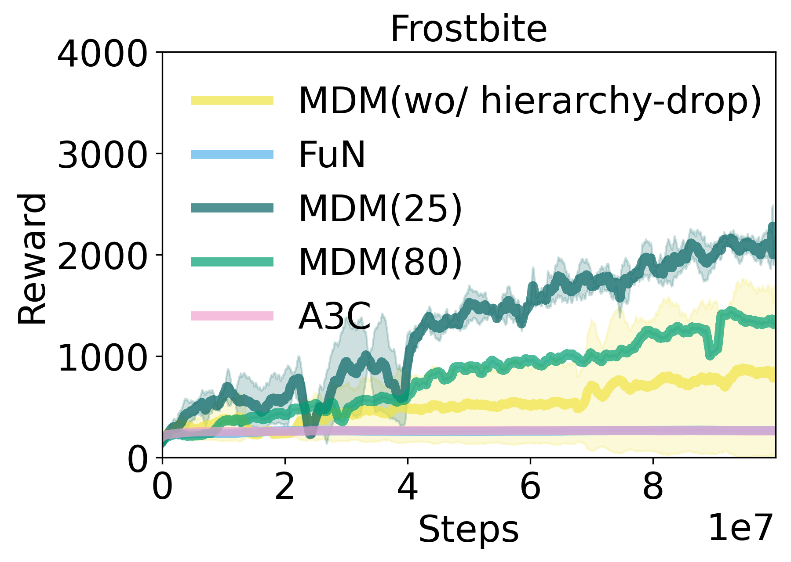

## From Extensive to Efficient: Dynamic Hierarchical Reinforcement Learning withAdaptive Long Short-Term Goals


This code is for "From Extensive to Efficient: Dynamic Hierarchical Reinforcement Learning withAdaptive Long Short-Term Goals". Our work introduced hierarchy-drop, novel approach that dynamically tailors hierarchies in accordance with environmental needs to improve the efficiency and effectiveness of learning in complex environments.

Authors: Jong Won Kim, Dongjae Kim

## Model Structure


## Installation

To run the code, please follow these steps:
1. Clone the repository.
```
git clone https://github.com/Jong-w/MDM.git
```
Install dependencies using the requirements.txt file:

2. Move directory
```shell
cd MDM
```

3. Install the dependencies
```
pip install -r requirements.txt
```


## Train
```
python MDM_main.py \
    --env_name='FrostbiteNoFrameskip-v4' \
    --gamma_5=0.999 \
    --gamma_4=0.999 \
    --gamma_3=0.999 \
    --gamma_2=0.999 \
    --gamma_1=0.999 \
    --hidden-dim-Hierarchies = [16, 256, 256, 256, 256]\
    --time_horizon_Hierarchies = [1, 10, 15, 20, 25]
```


## Result
We demonstrate the efficacy of our approach through extensive experiments. Our model shows significant improvements over baseline models in various environments.


<p align="center">



</p>


## Citation
If you find our work useful in your research, please consider citing:
```
@article{EfftoEff,
  title={From Extensive to Efficient: Dynamic Hierarchical Reinforcement Learning withAdaptive Long Short-Term Goals},
  author={Jong Won Kim, Dongjae Kim},
  journal={~~~},
  year={2024}
}
```