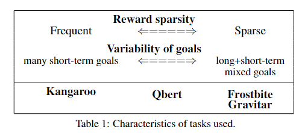

## From Extensive to Efficient: Dynamic Hierarchical Reinforcement Learning withAdaptive Long Short-Term Goals

This code is for "From Extensive to Efficient: Dynamic Hierarchical Reinforcement Learning withAdaptive Long Short-Term Goals".

Authors: Jong Won Kim, Dongjae Kim

## Usage
It is highly recommanded to adopt Conda/MiniConda to manage the environment to avoid some compilation errors.

1. Clone the repository.

git clone https://github.com/Jong-w/MDM.git

2. Install the dependencies

pip install -r requirements.txt

## Train

python MDM_main.py \
    --outdir=output_path \
    --gpus=8 \
    ~~~(요런 느낌의 하이퍼파라미터)

## Inference

## RESULTS
Results for the performance of RMADDPG and QMIX on the Particle Envs and QMIX in SMAC are depicted here. 
These results are obtained using a normal (not prioitized) replay buffer. (요거 수정)

(환경 나눈 것 설명)

(결과 plot)

